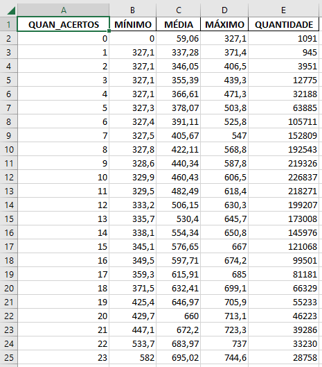

# Microdados Enem 2019
 Usa os microdados do ENEM e o Pandas para tentar prever a nota baseado na quantidade de acertos

## Divisão
O programa é dividido em 3 partes:

A primeira faz a filtragem dos dados selecionando apenas o que interessa.

A segunda calcula a quantidade de acertos para cada candidato.

A terceira exporta o resultado obtido: médias, mínimos e máximos.

## Descrição
Os microdados são arquivos no formato .csv que contém varias informações sobre os canditados que fizeram a prova. O link de acesso:
https://www.gov.br/inep/pt-br/acesso-a-informacao/dados-abertos/microdados

Na parte de dicionários no arquivo dos microdados é possível ver todas as colunas do arquivo, seu significado e várias outras informações essenciais para entender o código. Por exemplo, os codígos para cada cor de prova estão descritos nos dicionários.

O código está pronto para calcular a relação para a parte de Matemética da aplicação regular do ENEM 2019, não usa a reaplicação.

No código, eu tentei implementar a Orientação à objeto para treinar o que eu aprendi
## Informações para executar
Para executar é preciso ter o python e a bibliotaca do pandas instalados. Além de ter os microdados no mesmo local que o arquivo do python.

O arquivo que mais demora para concluir é o segundo que precisa de, em torno, de 17 mim. Numa primeira versão do código demorava uns 6 dias para concluir, mas eu descobri que eu implementei errado o .iloc do Pandas, quando usei outra lógica o tempo diminuiu muito

Uma dica para quem converter o arquivo .py para .exe é que quando o programa executar vai salvar o resultado num arquivo e modifica-lo, nesse processo alguns anti-vírus costumam bloquear a ação e isso gera um erro no código.
## Resultado
Ao final dos passos o resultado em matemática, por exemplo, é:

